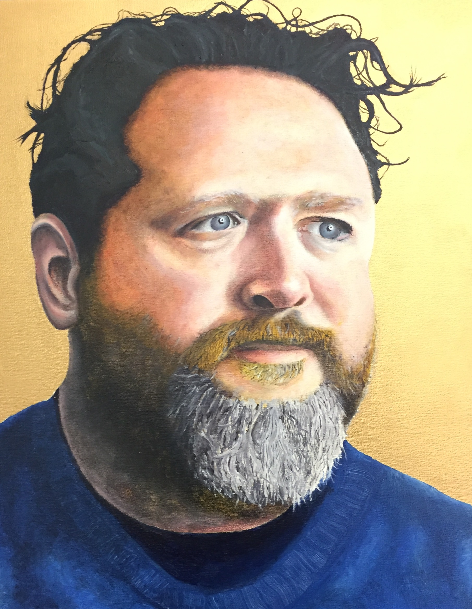

<meta charset="UTF-8">

<head>
	
</head>

<body style="background-color:FloralWhite;">
	<h1 style="font-family:verdana;">Welcome!</h1>
	

	<h3 style="font-family:verdana;">My name is Haofeng Chen.</h3>
	 A collection for some of my projects presents below.
	 
(Please scroll down to see a timeline of projects)

	 
	 
	 
    
    
    
    
    
    
	 <h4 style="font-family:verdana;">Robotic suits generation 1 through 6.</h4>
	 
    
	<h4 style="font-family:verdana;">Robotic arms generation 1 through 4.</h4>
	 
    
	
    
	
    <h4 style="font-family:verdana;">Ming dynasty empress crown replica (1600)，antique jewelry repair, jewelry design.</h4>
	 
    
	
    
    
    
    
	 
    
    

<h4 style="font-family:verdana;">Paintings and drawings.</h4>
	 
	 
	 
	 
	 
	

<h1 style="font-family:verdana;">Robotic Suit Project</h1>
	<h3 style="font-family:verdana;">A passion that drives me to make 6 generations over 7 years</h3>
	 
<h4 style="font-family:verdana;">First generation suit:</h4>

This was the first suit I made. I have always wanted one since the beginning of middle school. I had high expectations for it and aimed for too complicated structures. I spent two years researching without making any functional models. During the final year of my middle school, I decided to change my plan. I thought that I must start making something else my dream for building robotic suits will always remain unrealistic. Even a suit made of cardboards and foam is better than nothing. I knew as soon as I started the first one, all ideas would come to me and push me to make the second, the third, and more. Although it is a suit made of cardboard and foam, designs in those suits are special. I wanted to make a different suit than what was generally shown on the internet. Besides all the projects those military companies were working on, what I saw were just ones that try to imitate the shape and color of Ironman. Even for the real ones that companies were working on, they were focused on the strength of the suit. So I decided to attack the problem at a different angle. I focused on building a whole body suit that can be folded into a box, like the Mark 5 suit in Ironman 2.	

	 
<h5 style="font-family:verdana;">Designing the firt Generation</h5>
	
	
	
	
	 
<h5 style="font-family:verdana;">Making the first Generation</h5>

	 
	 
	 
	<h3 style="font-family:verdana;">Second Generation Suit:</h3>

After I gained confidence from the making of my first suit, I planned on making the second one just a few months later. For this one, I tried to aim for simplicity. I was in my last year in middle school and I didn’t know how to do CAD, not even two dimensional ones. However, I was introduced to a cheaper access to a CNC machine, one that uses lasers to cut metals. I knew it would open a new door for me, but the machine only reads CAD. My father is an architect and he works with CAD all the time. He told me that he can draw some simple CAD for me. Therefore, I tried to make the drawings as simple as I could, and finally ended up with only 11 different shaped parts. I added 8 servos on that suit and tested them using the RC airplane setup I knew. I tried to use a servo controller instead, but I never didn’t figure out how it works.
	

<h5 style="font-family:verdana;">Making the Second Generation</h5>

	 
	 
	 
	<h3 style="font-family:verdana;">3rd Generation Suit:</h3>

The third generation was my least favorite one. It only differs from the second by those extra plates mounted on its frame. I was just trying to figure out how and where I can mount armor on the frame. Although the third generation suit doesn’t have as many stunning features as all other ones, it was a necessary step toward the designing of future models. 

<h5 style="font-family:verdana;">Designing the 3rd Generation</h5>

<h5 style="font-family:verdana;">Modeling the 3rd Generation</h5>

<h5 style="font-family:verdana;">Making the 3rd Generation</h5>
	
(In the hallway of my freshmen year's dorm)

<h5 style="font-family:verdana;">The 3rd generation sitting on my bed</h5>

	 
	 
	 
	 
	<h3 style="font-family:verdana;">4th Generation Suit:</h3>

Since I can’t come up with any better frame design than that of the third generation, I made the fourth generation focusing on the armor. I realized a problem when I was making the previous suit: it was very hard to put on. Putting on the second generation wasn’t a problem because it didn’t have those mounting plates on them. As long as I want to have full body armor on my suits, I will not be able to put on the suit easily. I thought about designing a suit that can split into parts, like the Mark 42 from Ironman. If each individual part of the suit can be easily worn separately, the total amount of time to put up the suit can be reduced. I assume in the future whoever is wearing that suit will be facing his danger instead of giving his back to it. Armors at the front of the suit need to be stronger and with better integrity. I chose to put the opening mechanism on the back of my suit, trading the percentage of armor coverage for convenience to put on the suit. I didn’t choose to make the armor in one single material. I thought it would be better to use several layers of different materials to achieve the desired durability. I used balsa wood for the basic frame of different armor plates as an effort to reduce weight. According to my research on bulletproof vests, it is common to have two layers working together to stop impacts. The outer layer is the impact plate, which was made of KEVLAR that takes most of the bullet’s impact. The inner layer is made out of fiberglass, which prevents major deformation of the suit and stops the shock transferred from the outer layer. The combination of these two types of layers is classic for modern day bulletproof vests. In addition, I decided to put another layer on the surface of the suit. I put down a layer of ceramics that was designed to slightly change the path of the bullet as it is hit and crashes, avoiding a direct impact on the suit. I used magnets as locks on the suit, but they were only able to hold the suit together when I was standing still. As long as I start moving, I run the risk of falling parts. As a result I had to add mechanical locks on top of every magnet to secure the plates, but that contradicted the whole idea of speeding up the time of putting on the suit. I tried to add wooden locks inside the suit so it is able to stand up even without a person inside. I was successful at the beginning, but all those locks broke due to one fall of the suit. Since they were made inside the suit, I wasn’t able to replace them after they broke. 

<h5 style="font-family:verdana;">Designing the 4th Generation</h5>

<h5 style="font-family:verdana;">Making the 4th Generation</h5>

 
 

 

<h5 style="font-family:verdana;">Opening machanism of the suit</h5>	

<h5 style="font-family:verdana;">Electronics on the suit</h5>

	 
	 
	 
	<h3 style="font-family:verdana;">5th Generation Suit:</h3>

The third and fourth generation focused on two very different functions: frame and armor. For a period of time I thought I was going to make two different types of suits, one that gives the user strength, and the other offers protection. However, all diverging things have a dream of reunion. It was a winter night during my sophomore year, my friends invited me to go ice skating with them on a frozen pond in our school. I went there with them but weren’t brave enough to join them on the ice. I sat on a bench and watched them having fun skating. I was staring at their movements, and a cold breeze on my face inspired me. I suddenly thought of a design that surpasses the previous generations so far, one that combines the third and fourth generation perfectly. I ran back to my dorm and sketched down that design. But the number one reason why that design finally turned into a real product was related to a new skill I learned very recently: Solidworks.
	  The fifth generation suit was a keystone on my path that exceeded all my other previous projects so far. The usage of CAD and CNC made it a sign of me starting to transform from just making “toys” to designing industrial products. The goal for that suit was no longer just trying to imitate the functions of Ironman. I aimed for a low-cost functional bulletproof suit that can also enhance the user’s strength, but most importantly, can be mass produced right at the time. I wanted to be the “wizard” that turns fantasy to reality. Sure many companies were developing all types of exo-skeletons, but none of them were selling “armored robotic suits.” Beside the overall importance that fifth generation suit represents, there are also many worth mentioning details on it. 
	  Modifications on the frame can be organized into two efforts: allowing the suit to completely open from the back and enabling more movements that the suit can perform. For the suit to open from the back, one modification was on the part that connects the body frame to legs. For all previous generations I placed it at the back for unknown reasons. Just switching the position of that part, I was able to increase the integrity of the entire front of the suit. Another modification was on the shoulders. For previous generations, arms were mounted with two plates that attached both front and back of the body frame. By attaching arms only to the front, I not only made it easy to put on, but also enabled a new movement at shoulders. All other modifications on the frame for quicker suit up were based on the fourth generation suit. New designs for the armor were also influenced by the making of generation 4. I replaced balsa wood frames with machine cut aluminum frame to reduce manufacturing time, changed the resin plus fiberglass combination to fiberglass tape since there are no longer any curved surfaces, increased layers of KEVLAR for better protection, and abandoned the use of plastic on the surface because it was heavy and didn’t really do anything. Every armor plates on that suit was connected to the frame by strong Velcro to increase modularity. When an armor plate is damaged, it can be quickly replaced. I was at a peak in terms of the enthusiasm for designing. I thought I was on the right path and was ready for another explosion of ideas. Unfortunately, I had to stop those projects.

<h5 style="font-family:verdana;">Designing the 5th Generation</h5>
	

 

 

 <h5 style="font-family:verdana;">CNC parts for the 5th generation</h5>

 <h5 style="font-family:verdana;">Making and testing the 5th generation</h5>

(This suit was made in the staircase of my dorm during my sophomore year. It was the only place 
	 where I could stay up all night and work on my project.)

 

 <h4 style="font-family:verdana;">Testing the 5th generation's frame</h4>

(I made straps out of duct tape.)

 
 <h6 style="font-family:verdana;">Week 2 progress</h6>

<h4 style="font-family:verdana;">Details of the suit</h4>

 
 
 <h4 style="font-family:verdana;">Electronics on the suit</h4>

 <h4 style="font-family:verdana;">A poster I made to advertise the suit</h4>

 <h4 style="font-family:verdana;">Folding of the 5th Generation</h4>

(Based on previous experience with the first generation suit, I already had a pretty good sense on how to fold an entire robotic suit into a box.  For the purpose of convenient shipping, I designed the 5th generation suit also able to be packed.)

 <h4 style="font-family:verdana;">Putting on and dipaying the suit</h4>

(Jack was really interested in my suit during the building process, so I asked him if he wanted to be the first one trying on the finished product.)

 
I tried the suit on and presented in front of the whole school. I think that suit looks better when Jack wears it...  

 
 
 
 
<h2 style="font-family:verdana;">6th Generation Suit:</h2>
<h4 style="font-family:verdana;">In progress...although this suit should have joined the big family 2 years ago. </h4>

After testing the 5th generation, I had to choose betweeen whether should I do another prototype with minor changes or should I design a new suit. The 5th Gen was already a big thing at that time since I was just a high school sophomore. (<a href="https://www.dublinschool.org/consolidated-blog/2017/5/22/excited-about-the-distance-nemo-chen-on-how-to-make-a-robotic-suit-in-3-weeks">An interviewed</a>) There were no significant designing errors in that suit. With small modifications and some more tests it is prepared to be mass-produced. I was aware of all those but stopping there just wasn't my style. Whenever we have to design something in high school science classes, I was always leading the designing trend. I would make a design at first; then it is tested to be the best; then the entire class starts to copy my design. But at the time they copied mine, I already have a new design which is much better. I can come up with generations fast enough that I always stood at a higher level. As a result, I chose to design generation six. I had all sketches and measurements ready during the summer of my sophomore year and I was going to start doing CAD as soon as I came back to school. 
 
 	
This never happened. Although I am good at engineering and I enjoys my work, I had to face something I didn't have any talent for: standardized testing. I eventually got that 1560, but time spent on that plus college application was two years, longer than any project listed on this website.
 
 
Now I finally get some time to keeping making robotic suits, but who knows how many generations I would have done if this sixth-Gen was made two years ago.

<h4 style="font-family:verdana;">Designing the 6th Generation</h4>

 

<h4 style="font-family:verdana;">Paper model on new leg design</h4>

(locks on the leg that allow the suit to be able to stand up without a person inside)

(This design will highly increase the speed of getting in the suit)

 <h4 style="font-family:verdana;">CAD drawings</h4>

 <h4 style="font-family:verdana;">To be continued...</h4>	

 
 
 
 
 
<h1 style="font-family:verdana;">Art Project</h1>
<h3 style="font-family:verdana;">(Replicating a national treasure for fun)</h3>

This is a Wikipedia page for illustration: <a href="https://en.wikipedia.org/wiki/Fengguan">https://en.wikipedia.org/wiki/Fengguan</a>

One day I went to the National History Museum of China. I saw a spectacular crown sitting in a glass case. I fell in love with it and really wanted one for my own. Then I did some research online and figured out that it was no ordinary crown. What I saw was a Ming dynasty empress crown that was made by a special feather-inlay technique, and is a special law that it can't be diplayed abroad. I wanted that crown from the bottom of my heart and I knew I can't buy one, so I decided to make one out of my own.

<h3 style="font-family:verdana;">Making of the empress crown</h3>

(Parts made out of brass)

(Adding twisted brass wire edgings)

(Inlaying feathers)

(Making a structure out of bamboo)

(Working with rubies, sapphires, and pearls)

(Putting everything together)

A picture taken by my friend John Rong:

 
 
 
<h1 style="font-family:verdana;">Thank you for visiting this website. </h1>

This is the first wesite I made using HTML:)

I like this more than templates.

 
</body>

</html>
